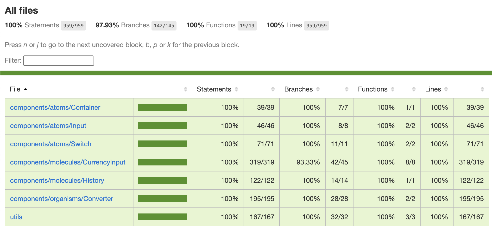

# Currency converter

## 🖋️ Description

This project aims to be able to convert currencies between EUR and USD. Every 3s a refresh of the current real rate is done (mocked by a random add or sub of 0.05).

This was done in 6h as a technical test (2h coding / 4h testing)

| Desktop                                                  | Mobile                                                 |
| -------------------------------------------------------- | ------------------------------------------------------ |
|  |  |

## 📋 Prerequisite

- NodeJs (with npm) => Min version LTS 20.9

## 🛠️ Used tools / libraries

```sh
# Code env
- ViteJs
- Tailwind

# Misc
- FontAwesome

# Tests
- Vitest (v8 coverage engine)
- React Testing Library
```

## 🚀 How to launch it

```sh
npm install
npm run dev
```

## 🤖 How to test it (and see the coverage)

```sh

  npm install # In case you didn't installed the project before trying to test it
  npm run coverage
```



## 🔗 Useful links

[Todo list](./todo.md)
[Backlog](./roadmap.md)
